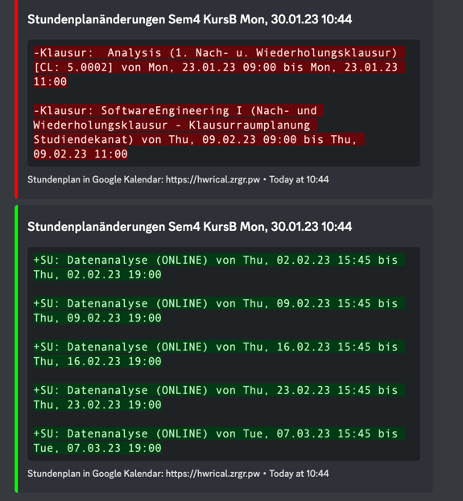

# HWR ICal Bot

This repository contains a Discord Bot which automatically posts message if a timetable change is detected.
This project is complementary to the [HWR ICal proxy](https://github.com/ZargorNET/hwr-ical).

## Showcase



## Example config

On startup a file named "config.toml" will be generated.
An example config could look like this:

```toml
bot_token = "token"

[[endpoints]]
channel_id = 000000000
ics_url = "https://hwrical.zrgr.pw/informatik/semester4/kursb/Englisch/Wiederholung"
display_name = "Sem4 KursB"

[[endpoints]]
channel_id = 000000001
ics_url = "https://hwrical.zrgr.pw/informatik/semester4/kursa/Analyse/Englisch/"
display_name = "Sem4 KursA"

```
